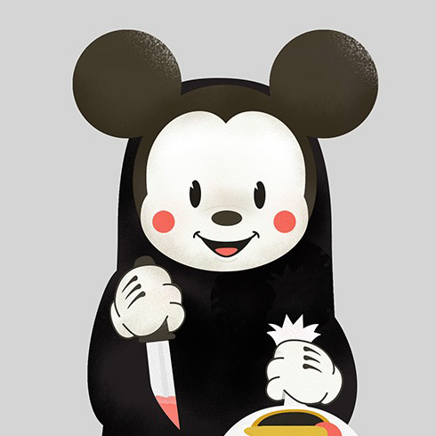

# 头像

头像是用图片、图标或者文字的形式展示用户及其他信息。

## 基本用法

使用 `.avatar` 类获得头像的外观展示，通常用在元素 `<div>` 上。

<Example class="flex gap-4">
  <div class="avatar"></div>
</Example>

```html
<div class="avatar"></div>
```

## 图标头像

配合[图标组件](/lib/icon)一起使用时，自动呈现为图标头像。

<Example class="flex gap-4">
  <div class="avatar -primary">图标</div>
</Example>

```html
<div class="avatar -primary">图标</div>
```

## 文字头像

配合文字一起使用时，呈现为文字头像。

<Example class="flex gap-4 flex-wrap items-end">
  <div class="avatar">头像</div>
  <div class="avatar">Z</div>
</Example>

```html
<div class="avatar">头像</div>
<div class="avatar">Z</div>
```

## 外观类型

配合使用[CSS 工具类](/lib/utilities/)来实现不同头像的外观。下面展示各种工具类的外观效果。

### 圆形头像

当与修饰类 `-rounded-full` 一起使用时则获得圆形头像。

<Example class="flex gap-4 flex-wrap">
  <div class="avatar -rounded-full"></div>
  <div class="avatar -rounded-full">头像</div>
  <div class="avatar -rounded-full">Z</div>
</Example>

```html
<div class="avatar -rounded-full"></div>
<div class="avatar -rounded-full">头像</div>
<div class="avatar -rounded-full">Z</div>
```

### 实心头像

<Example class="flex gap-4 flex-wrap">
  <div class="avatar -primary">Z</div>
  <div class="avatar -secondary">Z</div>
  <div class="avatar -success">Z</div>
  <div class="avatar -warning">Z</div>
  <div class="avatar -danger">Z</div>
  <div class="avatar -lighter">Z</div>
  <div class="avatar -light">Z</div>
  <div class="avatar -gray">Z</div>
  <div class="avatar -dark">Z</div>
  <div class="avatar -darker">Z</div>
  <div class="avatar -black">Z</div>
  <div class="avatar -inverse">Z</div>
  <div class="avatar -surface">Z</div>
</Example>

```html
<div class="avatar -primary">Z</div>
<div class="avatar -secondary">Z</div>
<div class="avatar -success">Z</div>
<div class="avatar -warning">Z</div>
<div class="avatar -danger">Z</div>
<div class="avatar -lighter">Z</div>
<div class="avatar -light">Z</div>
<div class="avatar -gray">Z</div>
<div class="avatar -dark">Z</div>
<div class="avatar -darker">Z</div>
<div class="avatar -black">Z</div>
<div class="avatar -inverse">Z</div>
<div class="avatar -surface">Z</div>
```

### 描边头像

<Example class="flex gap-4 flex-wrap">
  <div class="avatar -rounded-full -primary-outline">Z</div>
  <div class="avatar -rounded-full -secondary-outline">Z</div>
  <div class="avatar -rounded-full -success-outline">Z</div>
  <div class="avatar -rounded-full -danger-outline">Z</div>
  <div class="avatar -rounded-full -important-outline">Z</div>
  <div class="avatar -rounded-full -lighter-outline">Z</div>
  <div class="avatar -rounded-full -light-outline">Z</div>
  <div class="avatar -rounded-full -gray-outline">Z</div>
  <div class="avatar -rounded-full -dark-outline">Z</div>
  <div class="avatar -rounded-full -black-outline">Z</div>
</Example>

```html
<div class="avatar -rounded-full -primary-outline">Z</div>
<div class="avatar -rounded-full -secondary-outline">Z</div>
<div class="avatar -rounded-full -success-outline">Z</div>
<div class="avatar -rounded-full -danger-outline">Z</div>
<div class="avatar -rounded-full -important-outline">Z</div>
<div class="avatar -rounded-full -lighter-outline">Z</div>
<div class="avatar -rounded-full -light-outline">Z</div>
<div class="avatar -rounded-full -gray-outline">Z</div>
<div class="avatar -rounded-full -dark-outline">Z</div>
<div class="avatar -rounded-full -black-outline">Z</div>
```

### 头像文本颜色

搭配 CSS 工具类 `-text-*` 修改头像文本颜色。

<Example class="flex gap-4 flex-wrap">
  <div class="avatar -rounded-full -text-primary">Z</div>
  <div class="avatar -rounded-full -text-secondary">Z</div>
  <div class="avatar -rounded-full -text-success">Z</div>
  <div class="avatar -rounded-full -text-warning">Z</div>
  <div class="avatar -rounded-full -text-important">Z</div>
  <div class="avatar -rounded-full -text-danger">Z</div>
  <div class="avatar -rounded-full -text-special">Z</div>
  <div class="avatar -rounded-full -text-lighter">Z</div>
  <div class="avatar -rounded-full -text-light">Z</div>
  <div class="avatar -rounded-full -text-gray">Z</div>
  <div class="avatar -rounded-full -text-dark">Z</div>
  <div class="avatar -rounded-full -text-black">Z</div>
</Example>

```html
<div class="avatar -rounded-full -text-primary">Z</div>
<div class="avatar -rounded-full -text-secondary">Z</div>
<div class="avatar -rounded-full -text-success">Z</div>
<div class="avatar -rounded-full -text-warning">Z</div>
<div class="avatar -rounded-full -text-important">Z</div>
<div class="avatar -rounded-full -text-danger">Z</div>
<div class="avatar -rounded-full -text-special">Z</div>
<div class="avatar -rounded-full -text-lighter">Z</div>
<div class="avatar -rounded-full -text-light">Z</div>
<div class="avatar -rounded-full -text-gray">Z</div>
<div class="avatar -rounded-full -text-dark">Z</div>
<div class="avatar -rounded-full -text-black">Z</div>
```

## 尺寸

除了默认大小，还提供了额外的 4 种预设尺寸。

<Example class="flex gap-4 flex-wrap items-end">
  <div class="avatar -xs"></div>
  <div class="avatar -sm"></div>
  <div class="avatar -lg"></div>
  <div class="avatar -xl"></div>
</Example>

```html
<div class="avatar -xs"></div>
<div class="avatar -sm"></div>
<div class="avatar -lg"></div>
<div class="avatar -xl"></div>
```

### 头像圆角

搭配 CSS 工具类 `-rounded-*` 为头像应用不同的圆角样式。

<Example class="flex gap-4 flex-wrap items-end">
  <div class="avatar -rounded-none"></div>
  <div class="avatar -rounded-xs"></div>
  <div class="avatar -rounded-sm"></div>
  <div class="avatar -rounded"></div>
  <div class="avatar -rounded-lg"></div>
  <div class="avatar -rounded-xl"></div>
  <div class="avatar -rounded-full"></div>
</Example>

```html
<div class="avatar -rounded-none"></div>
<div class="avatar -rounded-xs"></div>
<div class="avatar -rounded-sm"></div>
<div class="avatar -rounded"></div>
<div class="avatar -rounded-lg"></div>
<div class="avatar -rounded-xl"></div>
<div class="avatar -rounded-full"></div>
```
